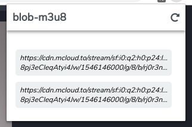
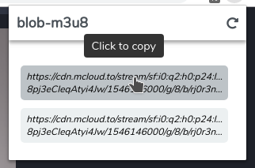

# blob-m3u8

blob-m3u8 is a chrome extension that finds blob links that make http requests for m3u8 files and displays the m3u8 files for allowing the user to copy the link and play in any m3u8 file supported application such as VLC media player

## Setup
Simply download and extract then run:

```
npm i
npm run bundle
```

Take the `blob-m3u8/src/chrome` folder and "Load unpacked" in chrome extensions page

Make sure to have `npm run bundle` while making changes to code so browserify can require the npm modules and `js` files in the browser

## Screenshots

<span>
  
  
</span>
